# 概述

## 问题思考
- touch一个文件，文件名可以任意长吗?
- 为什么我们电脑上的文件，会有2个“size”?
- 文件存储在磁盘上的时候，数据内容是连续存放的吗?
- 服务器上面的一个目录中最多能够存放多少个文件？
- 在Linux上执行`cat foo.txt`时，系统发生了什么？
- 使用本地文件系统的应用，如何做到不改应用代码却能直接使用云存储服务?
- 使用本地文件系统的应用使用云存储服务，性能必然受损，如何折中或者缓解?

## 了解文件系统的意义
- 了解文件系统是怎么来的，基本原理是什么，关键的演进变化，未来可能是什么样子。
- 对写业务/应用逻辑可能没有太大的帮助。
- 遇到一些无法解释的问题，知道底层的技术原理，可能会有很大的帮助。

## 为什么需要文件系统?
如果没有文件系统，计算机只能将磁盘视为一连串原始的比特数据流。既不会有文件和文件夹的概念，程序也难以定位特定数据，
存储空间将完全缺乏组织性和结构性。文件系统存在的几个关键原因：
- 组织数据存储：文件系统通过层级目录以逻辑方式分类数据，实现快速检索和访问。
- 为程序提供统一接口：文件系统提供open()、read()、write()等标准函数集，使程序无需处理底层细节即可完成基本操作。
- 实现跨设备/网络共享：得益于标准化的文件系统，数据可以在电脑、手机、移动设备及网络间无缝共享，而接口始终保持一致。

总结来说，文件系统在物理存储硬件与需要结构化数据管理的软件之间架起了关键桥梁。

## 一个文件包含哪些信息?
如下图，是MacOS上一个文件(foo.txt)的信息简介:  
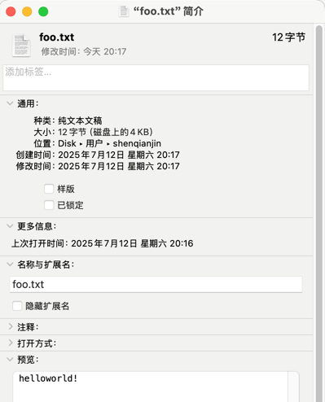
- 数据本身
- 元数据

## 文件系统做什么事情?
文件系统一般需要完成两项核心任务：
- 定位磁盘数据位置
- 记录数据块与文件的归属关系

为实现这些功能，文件系统一般包含以下三大技术要素：
- 元数据结构（记录文件属性与存储信息）
- 分配策略（管理磁盘空间分配）
- 组织逻辑（构建目录层次与访问规则）

## 附: 如何查看文件系统类型？
以下是方式之一:
```shell
# macOS
mount
# Linux
mount -l
```

# 文件系统

文件系统（File System）是操作系统用于管理和存储文件的技术，随着计算机技术的发展，文件系统也经历了多次演进。  
从早期简单的文件系统到现代复杂的分布式文件系统，每种文件系统都有其独特的设计和应用场景。

**传统文件系统演进简述**
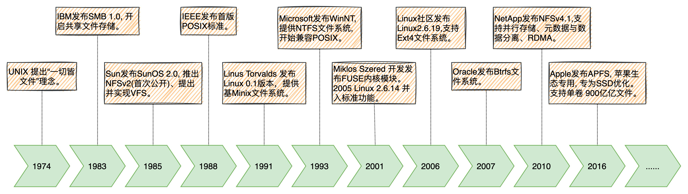

**分布式文件系统演技简述**
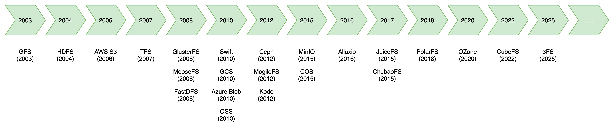

## 单机文件系统
- 1974年，贝尔实验室正式对外发布Unix, 使用UFS(Unix File System)文件系统。引入索引节点（inode）和多级目录结构，支持权限控制。
> 因为涉及到反垄断等各种原因，加上早期的Unix不够完善，于是贝尔实验室以慷慨的条件向学校提供源代码，所以Unix在大专院校里获得了很多支持并得以持续发展。于是出现了好些独立开发的与Unix基本兼容但又不完全兼容的OS，通称Unix-like OS。
- 1988年，IEEE发布首版POSIX标准 (IEEE Std 1003.1-1988)。
> 20世纪80年代中期，Unix厂商试图通过加入新的、往往不兼容的特性来使它们的程序与众不同。局面非常混乱，麻烦也就随之而来了。
> 
> 为了提高兼容性和应用程序的可移植性，阻止这种趋势， IEEE(电气和电子工程师协会)开始努力标准化Unix的开发，后来由 Richard Stallman命名为“Posix”。
> 
> 谁遵循这个标准呢？
> > Unix、Linux、苹果的操作系统也是Unix-based。Windows从WinNT开始被迫兼容POSIX (当年在要求严格的领域，Unix地位比Windows高。为了把Unix用户拉到Windows阵营)。
- 1991年: Linus Torvalds 发布首版 Linux 0.1版本，提供基础进程管理和Minix文件系统。
- 1993年: 微软为Windows NT设计NTFS文件系统，开始支持了现代文件系统的高级特性，例如文件压缩、加密、细粒度权限控制、事务日志等。
- 2006年, 发布 Ext4, 扩展Ext3，支持区段（extent）存储、延迟分配（delayed allocation）和更大的文件系统容量（1EB）。

## 单机文件系统 - 对比

| **文件系统** | **发布时间** | **开发方** | **主要特点** | **最大单文件** | **最大分区** | **单目录最大文件数** | **跨平台兼容** | **适用场景** | **优势** | **局限** |
|---|---|---|----------|---|---|---|---|---|---|---|
| **NTFS** | 1993 (Win NT) | Microsoft | 支持ACL、日志、加密，Windows生态兼容 | 256TB | 256TB | 约 429万（理论值）| (Win/Linux/macOS) | Windows系统盘、跨平台存储 | 兼容性好，支持ACL和加密 | Linux下写入需 ntfs-3g，性能较低 |
| **Ext2** | 1993 | Linux社区 | 无日志，简单高效，适合嵌入式设备 | 2TB | 16TB | 约 4.2亿（受inode限制）| Linux |
| **XFS** | 1994 (IRIX) | SGI (现Oracle) | 高性能日志，擅长大文件和高并发，支持动态inode分配 | 8EB | 8EB | 理论无限（B+树索引）| Linux/Unix | 大数据、媒体服务器 | 高吞吐量，支持8EB大文件 | 删除大文件后空间回收慢 |
| **Ext3** | 1999 (Linux 2.4.15) | Linux社区 | 在Ext2基础上增加日志功能，提高崩溃恢复能力 | 2TB | 16TB | 约 4.2亿（同Ext2) | Linux |
| **Ext4** | 2006 (Linux 2.6.19) | Linux社区 | 支持Extent（连续块分配）、延迟分配，提升大文件性能 | 16TB | 1EB | 约 40亿（理论值）| Linux | Linux通用服务器/桌面 | 平衡性能与稳定性，支持16TB大文件 | 无快照、压缩等高级功能 |
| **Btrfs** | 2007 | Oracle | 支持快照、压缩、去重、RAID，面向现代存储需求 | 16EB | 16EB | 理论无限（64位架构）| Linux | NAS、虚拟机存储 | 快照、数据去重、RAID支持 | RAID 5/6不稳定，碎片问题显著 |
| **APFS** | 2016 (WWDC) | Apple | 专为SSD/闪存优化，支持快照、加密、空间共享，苹果生态专用 | 8EB | 8EB |理论无限（容器化设计）|  Apple | macOS/iOS设备、SSD优化场景 | 写时复制、加密、空间共享 | 仅限苹果生态，Windows兼容性差 |

**对比总结：**
- NTFS：Windows 生态首选，Linux 支持需 ntfs-3g。
- Ext4：Linux 默认选择，适合通用场景。
- XFS：企业级高性能存储（RHEL/CentOS 默认）。
- Btrfs：未来可能替代 Ext4，但生产环境需谨慎使用 RAID 5/6。

## 单机文件系统 - 性能对比
| **场景** | **性能** |
|--------|---|
| **大文件顺序读写** | **XFS** 和 **Ext4** 表现最佳（如视频编辑、科学计算）。**NTFS** 在 Windows 下优化较好，但在 Linux（`ntfs-3g`）性能较低。 |
| **小文件随机读写** | **Ext4** 在数据库类应用（如MySQL）中表现稳定。**Btrfs** 因写时复制（CoW）机制，频繁写入时性能下降。|
| **高并发访问** | **XFS** 在多线程环境下（如HPC、AI训练）吞吐量最高。**Ext3/Ext4** 在低并发时更稳定。 |
| **元数据操作** | **XFS** 早期删除小文件性能差，后通过“延迟记录”优化。 **Btrfs** 因复杂元数据管理，目录操作较慢。 |

## Ext4 数据组织

假设你手里有一块硬盘，大小为 1T，你还有一堆文件。这些文件在硬盘看来，就是一堆二进制数据而已。
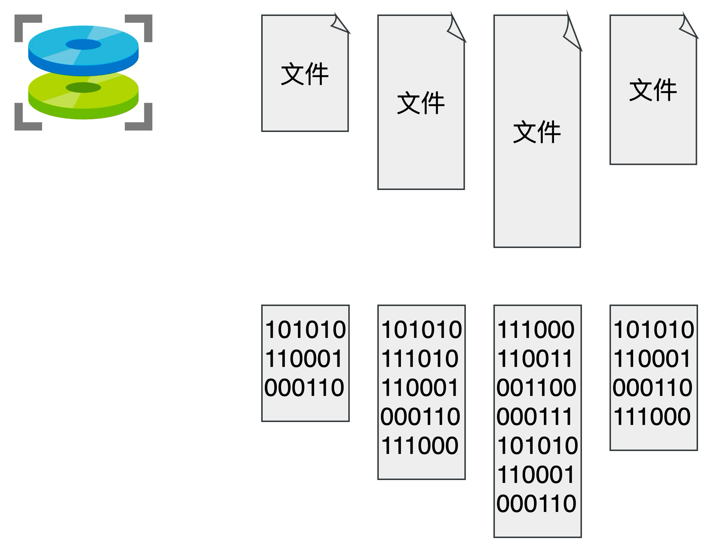
你准备把这些文件存储在硬盘上，并在需要的时候读取出来。如何设计？

先实现了一个简单的功能，将硬盘按逻辑分成一个个的块，并可以以块为单位进行读写。
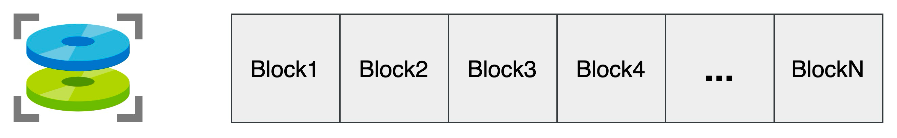

尝试写入的时候，怎么知道哪些块可以写入数据呢？
> 记录所有块的使用情况吧！怎么记录呢？位图！

尝试读取时，我怎么找到刚刚的文件呢？ 
> 给每个文件起一个名字，叫文件名，通过它来寻找这个文件。   
> 那必然就要有一个地方，记录文件名与块号的对应关系。   
> 既然都要选一个地方记录文件名称了，不妨多记录一点我们关心的信息吧，比如文件大小、文件创建时间、文件权限等。  
> 这些东西自然也要保存在硬盘上，Ext4选择用一个固定大小的空间，来表示这些信息 (ext2/exr3空间大小为128 字节, ext4为支持更多的扩展属性,支持到160字节)。

这 128/160 字节的结构体，就叫做一个 inode。
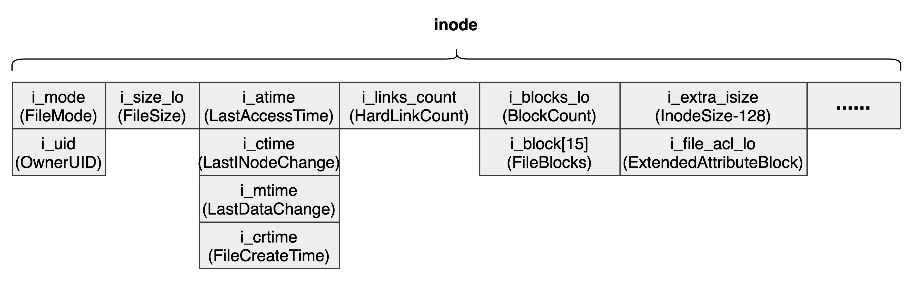
> 之后，我们每存入一个新的文件，不但要占用一个块来存放这个文件本身，还要占用一个 inode 来存放文件的这些元信息，
> 并且这个 inode 的所在块号这个字段，就指向这个文件所在的块号。

这样，inode就在存放一定元数据的同时，可以定位到inode对应的具体的数据内容了。

> 如果一个 inode 为 128 字节，那么一个1KB的块就可以容纳 8 个 inode，我们可以将这些 inode 编上号。
> 随着存入文件的增多，需要使用两个或者多个块来存放 inode 信息。

同样，和块位图管理块的使用情况一样，我们也需要一个 inode 位图，来管理 inode 的使用情况。

**一个文件系统有多少个 inode?**
> - 查看文件系统 inode 使用情况: `df -i`
> - 指定文件系统查看文件系统 inode 使用情况: `df -i /dev/sda1`
> - 在格式化文件系统时，可通过以下选项调整 inode 数量：
>   - -N：直接指定 inode 总数（如 mkfs.ext4 -N 2000000 /dev/sdX）
>   - -i：指定每多少字节分配一个 inode（如 mkfs.ext4 -i 2048 /dev/sdX，表示每 2KB 分配一个 inode）
>   - 默认情况下，mkfs.ext4 会根据分区大小自动计算 inode 数量。
>   - 创建后无法直接修改 inode 数量。

**思考: inode上需要存放文件名吗？为什么?**

如果是普通文件，则这个 inode 所指向的数据块仍然和之前一样，就是文件本身原封不动的内容。  
但如果是目录文件，则这个 inode 所指向的数据块，就需要重新规划了。 这个数据块里应该是什么样子呢？  
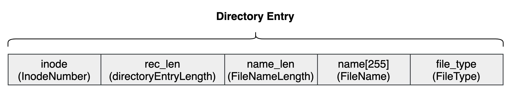
这样的话，如果想要查看一下某个目录下的所有文件（比如 ll 命令），将文件名和文件类型都展示出来，怎么办呢？  
只需要读取dentry指向的数据块内容即可，不需要把一个个结构体指向的 inode 从 inode 表中取出，再把文件名和文件类型取出(这很是浪费时间)。
> 注: 让用户看到一个目录下的所有文件，又是一个极其常见的操作。
> 规定: inode 表中的 0 号 inode，就表示根目录，一切的访问，就从这个根目录开始！

混合了目录和普通文件的文件系统存储布局样例:
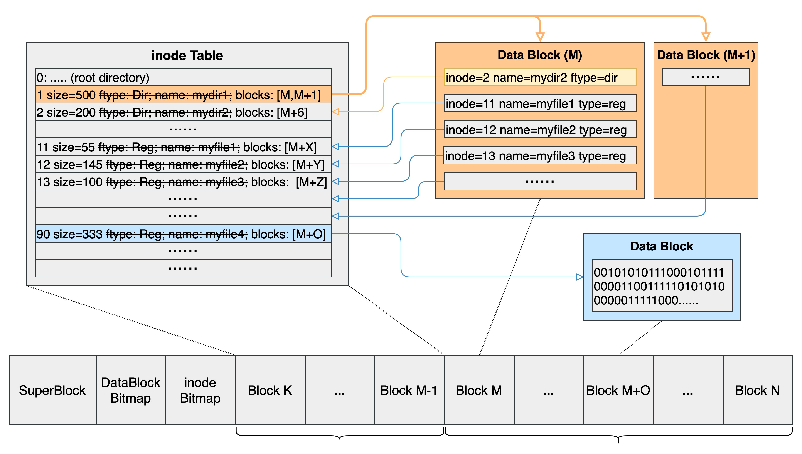
这样，就可以通过文件所在目录文件，找到所在的数据块。再根据这个数据块里的一个个带有 inode 信息的结构体，找到这个目录下的所有文件了！

**思考: inode 的 i_blocks 是一个大小为 15的数据，如果一个文件很大，15个数据块放不下，怎么办?**

## Ext4 数据组织和间接寻址
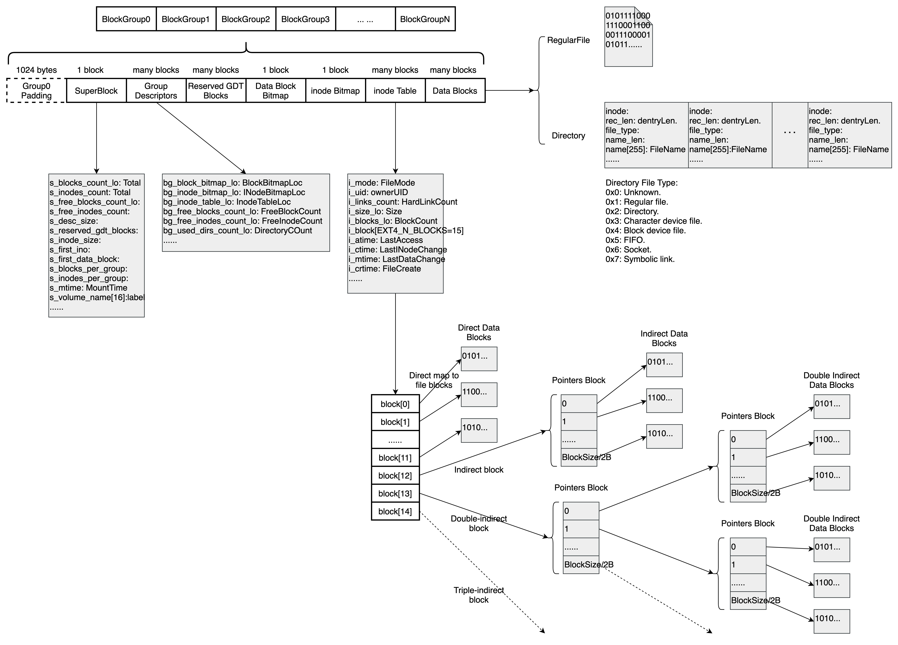
[Ext4文件系统存储结构](https://www.kernel.org/doc/html/latest/filesystems/ext4/overview.html#layout)

**说明**
- ext4文件系统以"块"为单位分配存储空间。块是由1KiB至64KiB大小不等的扇区组构成(默认4KB)，且扇区数量必须是2的整数次幂。
- 希望每次访问的内容都集中在磁盘的一片区域里，为此把磁盘分成不同的组。
- 每组的结构相同，均包含超级块、组描述、数据位图、inode位图、inodeTable和数据块。
- 超级块的部分信息是整个文件系统的信息，相当于在不同的组里进行了备份。
- 写数据是尽量把文件夹和其中的文件存放于相同(或相邻)的组中，以尽可能减少寻道距离。 因为多数时候我们都是在访问某局部文件夹中的文件。
- 写入新数据需要分配新的块时，一共要做三次更新，数据位图、文件inode和数据本身。
- 直接/间接块寻址：
> - Direct map to file blocks 0 to 11. (supported file size range is 0~44KB)  
> - Indirect block: (file blocks 12 to ($block_size / 4) + 11, or 12 to 1035 if 4KiB blocks). (max file size is about 4MB)  
> - Double-indirect block: (file blocks $block_size/4 + 12 to ($block_size / 4) ^ 2 + ($block_size / 4) + 11, or 1036 to 1049611 if 4KiB blocks). (max file size is about 4GB)  
> - Triple-indirect block: (file blocks ($block_size / 4) ^ 2 + ($block_size / 4) + 12 to ($block_size / 4) ^ 3 + ($block_size / 4) ^ 2 + ($block_size / 4) + 12, or 1049612 to 1074791436 if 4KiB blocks). (max file size is about 4TB)

## Ext4 小结: 磁盘访问的一些基本规则
- 磁盘一次只能读写一整块
- 存储文件必须存储内容数据和元数据
- 当文件大小小于一块，仍然占用一整块。
- 文件很小(0~44KB), inode直接映射到存储磁盘块。
- 文件较大(44KB~4MB), inode加一级间接索引到存储磁盘块。
- 文件超大(4MB~4GB), inode加二级间接索引到存储磁盘块。
- 文件巨大(4GB～), inode加三级间接索引到存储磁盘块。

## Ext4 可靠性保证
- 写入新数据需要分配新的块时，一共要做三次更新，数据位图、文件inode和数据本身。如果在这个时候发生断电或系统奔溃怎么办？
> 比如可能inode和位图已经更新，但数据位图却没能显示新分配出去的块。 总之，可能会发生数据不一致，或用户不想要的结果。 
>
> 我们在实际写数据之前先记录下要更新的内容和要写入的地址, 即inode, 位图，和数据。 称这样的记录为日志（journal）。
> 同时日志还会加上头部和尾部以划分界限。 
> 
> 头尾都记录有该日志的ID, 如果在写数据时发生崩溃，就可以救助于日志来获取应当写入的正确内容。 

- 在写日志的时候发生崩溃怎么办？ 
> 
> 比如日志的数据部分没有写入成功，那日志本身也是错误的内容。 看起来又回到了原来的问题?
> 
> 日志和原写入的数据的不同，日志还有头和尾。 如果我们先确认头部和数据部分写入成功，再写入尾部，便能确保日志的正确性。 
> 如果写头部和正文部分发生崩溃，直接取消这次写入。不会导致不一致。 
> 且日志最后的尾部控制在一个扇区大小内，即一个原子写入。 也不用担心被崩溃打断。 

- 但日志也带来了让人头疼的开销，每次写入都得先写日志，再真正写入。带宽只有原来的一半。
> 其实我们可以直接把写入内容的的主要部分，即数据部分，直接写入最终位置， 而日志中只写inode和位图，通过只写一次数据便省下了大笔开销。

> 文件系统也会给磁盘块在内存中设置缓存，这样就不用每次都大费周章定位文件位置， 大多数时候我们要访问的文件都在一个局部的文件夹里。
> 如果这个文件目录很深，则每次定位文件夹就得花大量的开销。
> 此外设置缓存还能在写数据时带来好处，通过延迟写，若某些带写入的数据后来被更新，只要写入更新后的数据即可，或者甚至直接被删除了，则压根就不用写了。
> 也可以批量处理任务，以尽可能连续读写。
> 但这样的延迟是有隐患的，如果系统崩溃了，缓存中待写入的数据也就丢失了。 必要的时候，可以调用fsync强制执行写入。

**注: 目录查找流程**
- 读取目录内容： 内核通过目录 inode 找到其 data block，解析为 ext4_dir_entry_2 结构数组。
- 线性搜索： 遍历目录项，比较 name 字段与目标名称（早期 ext4 默认方式）。
- 哈希索引优化（可选）： 若启用 dir_index 特性（默认开启），会使用 B+ 树加速查找（通过 dx_entry 结构）。

## 虚拟文件系统
1985年, Sun Microsystems 提出并实现 Virtual File System (VFS), 最初是为了支持 SunOS 2.0 操作系统中的 NFS（Network File System，网络文件系统），以解决不同文件系统之间的兼容性问题。

VFS 是操作系统内核中的一个抽象层，它为应用程序提供统一的文件操作接口（如 open()、read()、write()）， 同时屏蔽底层不同文件系统的差异，实现跨文件系统的无缝操作。
* 统一接口、跨文件系统兼容性： 提供通用的文件系统访问方式，屏蔽底层差异。
  * 允许 同时挂载 Ext4、NTFS、NFS 等不同文件系统，应用程序无需感知底层差异。
  * 允许 本地（如 UFS）、网络（如 NFS）和特殊文件系统共存。
  * 允许 /proc（进程信息）、/sys（内核参数）等虚拟文件系统通过 VFS 以文件形式暴露系统状态。
* 性能优化：通过 dentry 缓存 和 inode 缓存 加速文件路径解析，减少磁盘 I/O。
* 扩展性(简化开发)： 新文件系统开发者只需实现 VFS 定义的接口，即可集成到内核（如 Btrfs、ZFS），无需修改上层应用。
* 跨平台兼容性：允许 Linux 挂载 Windows（NTFS）、Mac（HFS+）等文件系统，实现数据互通。

VFS 的设计理念被广泛采纳，并影响了后续的 Unix 变种（如 Linux、FreeBSD 等） 。
> - 1994年: Linux 1.0 发布，初步集成 VFS 框架，支持 Ext、Minix 等早期文件系统。
> - 2001年: Linux 2.4发布，VFS 进一步完善，增加对日志文件系统（如 Ext3）和网络文件系统的支持。

## VFS - 实现机制

1985年, Sun Microsystems 提出 Virtual File System (VFS) 并实现，最初是为了支持 SunOS 2.0 操作系统中的 NFS（Network File System，网络文件系统），以解决不同文件系统之间的兼容性问题。

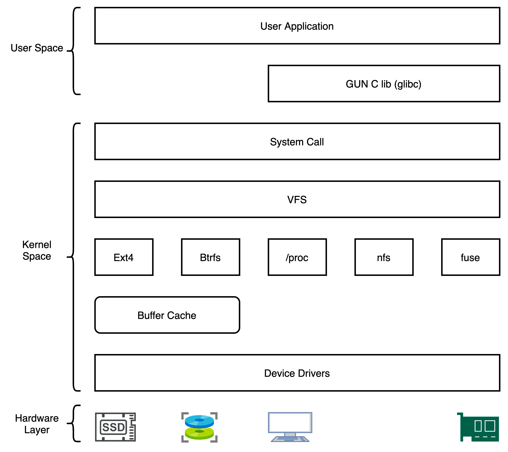

**附: 在Linux上执行`cat foo.txt`时，系统发生了什么?**
```shell
> strace cat foo.txt
...
open("foo.txt", O_RDONLY) = 3 // 打开文件: 并得到文件描述符3; 即便系统只处理一个文件, FD也是从3开始; 0、1、2分别对应标准输入、标准输出、标准错误文件
read(3, "hello\n", 4096) = 6  // 读取文件: 3为FD,4096为一次能读取的最大字节数;
write(1, "hello\n", 6) = 6    // 打印文件内容(往标准输出中写入内容)
hello
read(3, "", 4096) = 0         // 继续读取文件: 发现没有了
close(3) = 0                  // 关闭文件
close(1) = 0
close(2) = 0
...
```

## 共享文件系统
1976 年：DEC（Digital Equipment Corporation）开发了首个网络文件系统 File Access Listener，采用 DECnet 协议，但未广泛应用。  
1985 年：Sun Microsystems 推出 NFS v2（首个正式版本），作为 SunOS 2.0 的组件发布，采用 无状态协议 设计，基于 RPC（Remote Procedure Call） 实现跨系统文件共享。  
后来，NFS 从 Sun 的专有技术演变为 IETF 标准，至今仍是分布式存储的核心协议之一。 现已成为 UNIX 和 Linux 操作系统中普遍支持的标准组件。

共享文件存储相当于分布式文件系统种子，共享文件系统也是分布式文件系统核心的特性之一。

## 共享文件系统 - NFS

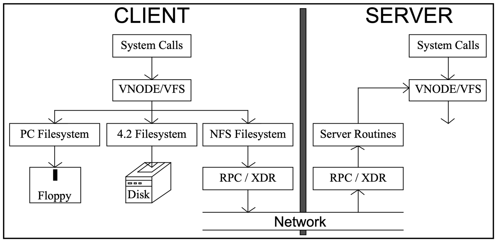
**系统组成:**
- NFS 服务器进程(守护程序)：管理文件系统并响应客户端请求。
- NFS 客户端进程：将本地文件系统请求转换为 NFS 请求。
- RPC (TCP/IP) 协议通信：主要使用两个 RPC 程序：一个用于挂载请求，另一个用于文件系统操作。

**工作流程:**
- 服务器端启动 RPC 服务(111端口)
- NFS 服务启动并向 RPC 注册端口信息
- 客户端 RPC 向服务端 RPC 请求 NFS 端口
- 服务端 RPC 反馈 NFS 端口信息
- 客户端建立 NFS 连接进行数据传输

## 共享文件系统 - 演进路径

| **协议** | **发布时间** | **发布者** | **适用系统** | **关键特性** | **优势** | **劣势** |
|---|---|---|---|---|---|---|
| **SMB 1.0** | 1983 | IBM | Windows/Linux (Samba) | 文件共享、NTLM 认证 | 原生 Windows 支持 | 性能差，漏洞多 |
| **CIFS** | 1996 | Microsoft | Windows/Linux (Samba) | 微软扩展SMB 1.0, 优化 Internet 文件共享，支持大文件。 | 跨平台兼容（通过 Samba） | 性能低下，安全性差，已淘汰 |
| **SMB 2.0** | 2006 | Microsoft | Windows Vista/Server 2008+ | 减少冗余指令，提升性能。支持 WAN 加速。 | 比 SMB 1.0 快 3-5 倍 | 仍依赖 NTLM，安全性有限 |
| **SMB 3.0** | 2012 | Microsoft | Windows 8/10/Server 2012+ | 加密、多通道、RDMA | 企业级安全与性能,适合云存储 | 配置复杂，需特定硬件（如 RDMA 网卡） |
| **SMB 3.1** | 2015 | Microsoft | Windows 8/10/Server 2012+ | 安全性增强、预读优化、QUIC 支持 | 更高安全性（GCM 加密）、QUIC 支持 | 需 Windows Server 2016+，配置复杂度高|
| **NFS v2** | 1984 | Sun | Unix/Linux | （SunOS 2.0）、RFC 1094（1989年）, 无状态、基于 UDP/TCP, 高吞吐 | 简单高效，适合局域网 | 无文件锁，安全性弱 |
| **NFS v3** | 1995 | Sun | Unix/Linux | RFC 1813，无状态、高吞吐，取消文件大小限制，支持异步写入。 | 提升大文件处理性能。 | 需额外 NLM 协议实现文件锁 |
| **NFS v4.0** | 2000 | Sun -> NetApp | Unix/Linux/Windows | RFC 3530，有状态，内置文件锁。、支持 RPCSEC-GSS 加密 | 安全性提升，适合企业级应用 | 配置复杂度增加 |
| **NFS v4.1** | 2010 | NetApp | Unix/Linux/Windows | 并行存储（pNFS），元数据与数据分离；支持 RDMA。 | 高吞吐量，适合分布式存储 | 需专用硬件支持 |

## 附: 用户态文件系统 FUSE

2001年,匈牙利计算机科学家Miklos Szeredi开发并首次发布FUSE(Filesystem in Userspace)。
最初的灵感来源于NFS(网络文件系统)架构，Szeredi设想将NFS的网络协议移植到单机端，用系统调用代替网络通讯，从而实现在用户态开发文件系统。

FUSE 是一种允许在用户空间实现文件系统的框架，它彻底改变了传统文件系统必须在内核空间开发的模式。

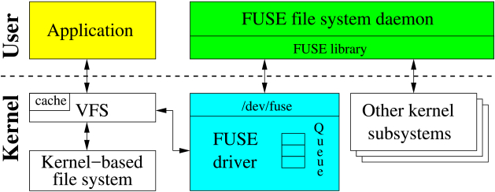  
FUSE High-level Architecture

解决的核心问题
- 内核文件系统开发门槛高：传统文件系统需要在内核空间开发，要求开发者具备内核编程知识，且调试困难。
- 内核版本兼容性问题：内核文件系统需要针对不同内核版本进行适配，维护成本高。
- 快速原型开发需求：科研和创新文件系统设计需要快速迭代，内核开发模式效率低下。
- 商业软件灵活性：商业公司希望实现专有文件系统功能而不必开源内核代码。

明显的技术劣势
- 性能开销：用户态与内核态切换导致性能损失，某些场景下性能下降可达83%。
- CPU占用率高：相比内核文件系统，CPU使用率可能增加31%。
- 功能限制：某些高级文件系统功能难以在用户空间实现。
- 多线程性能问题：随机读写性能较差，特别是处理大量小文件时性能下降明显。
- 平台兼容性：不同平台实现差异较大，特别是非Linux系统支持有限。

## 分布式文件系统

随着互联网普及，头部互联网厂商需要海量数据的存储，从而诞生了分布式文件系统，如 GFS、HDFS。

## 分布式文件系统 - GFS

GFS（Google File System）是由我们设计并实现的为大规模分布式数据密集型应用程序设计的可伸缩（scalable）的分布式文件系统。
GFS为在廉价商用设备上运行提供了容错能力，并可以在有大量客户端的情况下提供较高的整体性能。

**GFS Architecture**

如图所示，一个GFS集群包括单个master（主服务器）和多个chunkserver（块服务器），并被多个client（客户端）访问。
每个节点通常为一个运行着用户级服务进程的Linux主机。如果资源允许且可以接受不稳定的应用程序代码所带来的低可靠性，
那么可以轻松地在一台机器上同时运行chunkserver和client。

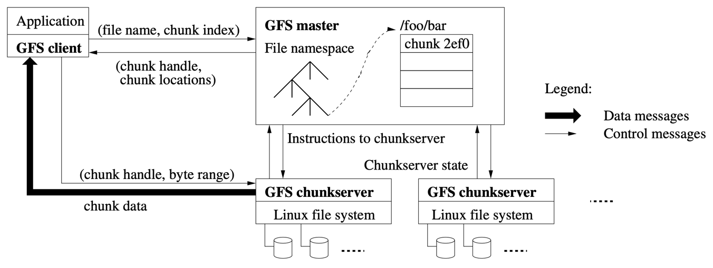

> 文件被划分为若干个固定大小的chunk（块）。每个chunk被一个不可变的全局唯一的64位chunk handle（块标识符）唯一标识，chunk handle在chunk被创建时由主节点分配。
> chunkserver将chunk作为Linux文件存储到本地磁盘中，通过chunk handle和byte range（字节范围）来确定需要被读写的chunk和chunk中的数据。
> 为了可靠性考虑，每个chunk会在多个chunkserver中有副本。我们默认存储三份副本，用户也可以为不同的命名空间的域指定不同的副本级别。
> 
> master维护系统所有的元数据。元数据包括命名空间（namespace）、访问控制（access control）信息、文件到chunk的映射和chunk当前的位置。
> master还控制系统级活动如chunk租约（chunk lease）管理、孤儿chunk垃圾回收（garbage collection of orphaned chunks）和chunkserver间的chunk迁移（migration）。
> master周期性地通过心跳（HeartBeat）消息与每个chunkserver通信，向其下达指令并采集其状态信息。
>
> 被链接到应用程序中的GFS client的代码实现了文件系统API并与master和chunkserver通信，代表应用程序来读写数据。
> 进行元数据操作时，client与master交互。而所有的数据（译注：这里指存储的数据，不包括元数据）交互直接由client与chunkserver间进行。
> 因为GFS不提供POXIS API，因此不会陷入到Linux vnode层。
> 
> 无论client还是chunkserver都不需要缓存文件数据。在client中，因为大部分应用程序需要流式地处理大文件或者数据集过大以至于无法缓存，所以缓存几乎无用武之地。
> 不使用缓存就消除了缓存一致性问题，简化了client和整个系统。（当然，client需要缓存元数据。）chunkserver中的chunk被作为本地文件存储，
> Linux系统已经在内存中对经常访问的数据在缓冲区缓存，因此也不需要额外地缓存文件数据。

**写入流程**

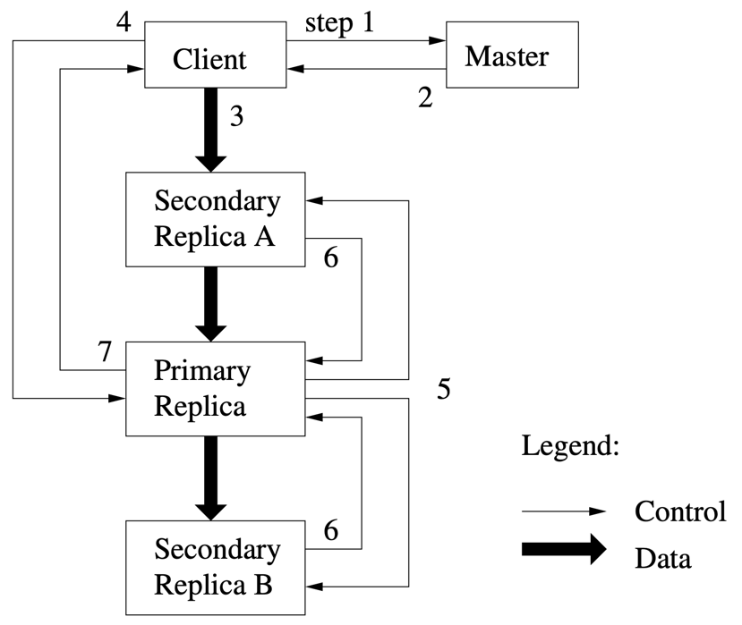

- 1 - client向master询问哪个chunkserver持有指定chunk的租约及该chunk的其他副本的位置。如果没有chunkserver持有租约，那么master会选择一个副本对其授权（这一步在图中没有展示）。 
- 2 - master回复primary副本的标识符和其他副本（也称secondary）的位置。client为后续的变更缓存这些信息。
      client只有当primary不可访问或primary向client回复其不再持有租约时才需要再次与master通信。 
- 3 - client将数据推送到所有副本。client可以按任意顺序推送。每个chunkserver都会将数据在内部的LRU中缓存，直到数据被使用或缓存老化失效（age out）。
      通过将数据流和控制流解耦，我们可以使用基于网络拓扑的技术来提高开销高昂的数据流的性能，且与哪台chunkserver是primary无关。章节3.2将对此进一步讨论。 
- 4 - 一旦所有副本都确认收到了数据，client会向primary发送一个write请求。这个请求标识了之前推送到所有副本的数据的作用。
      primary会为其收到的所有的变更（可能来自多个client）分配连续的编号，这一步提供了重要的顺序。primary对在本地按照该顺序应用变更。 
- 5 - primary将write请求继续传递给其他secondary副本。每个secondary副本都按照primary分配的顺序来应用变更。 
- 6 - 所有的secondary副本通知primary其完成了变更操作。 
- 7 - primary回复client。任意副本遇到的任何错误都会被报告给client。即使错误发生，write操作可能已经在primary或secondary的任意子集中被成功执行。
     （如果错误在primary中发生，那么操作将不会被分配顺序，也不会被继续下发到其他副本。）只要错误发生，该请求都会被认为是失败的，且被修改的区域的状态为inconsistent。
      client中的代码会通过重试失败的变更来处理这种错误。首先它会重试几次步骤（3）到步骤（7），如果还没有成功，再从write请求的初始操作开始重试。

## 下期预告

## 分布式文件系统 - AWS S3
## 分布式文件系统 - Kodo
## 分布式文件系统 - S3Plus

## 分布式文件系统 - CubeFS
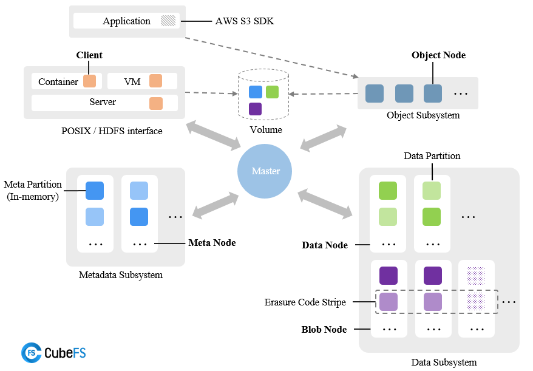

云原生计算基金会 （CNCF）托管项目，支持 S3 、 POSIX 、 HDFS 等多种访问协议，提供多副本与纠删码两种存储引擎，适用于容器化应用、大数据、AI等领域。 

## 分布式文件系统 - 3FS
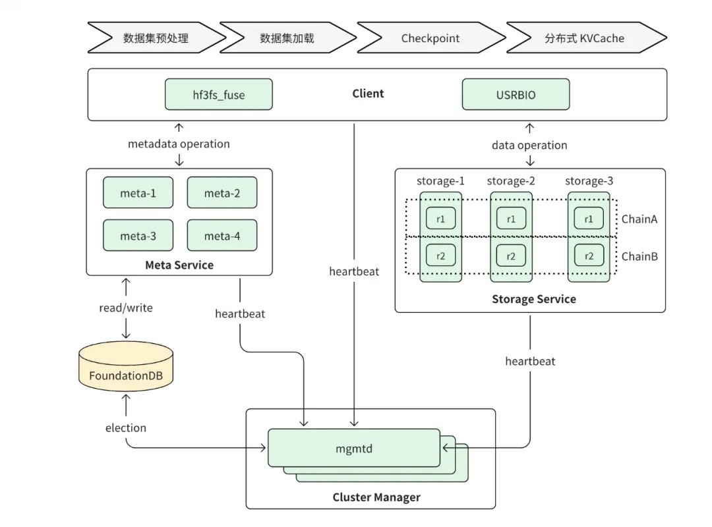

所有组件均接入 RDMA 网络实现高速互联，DeepSeek 内部使用 InfiniBand:
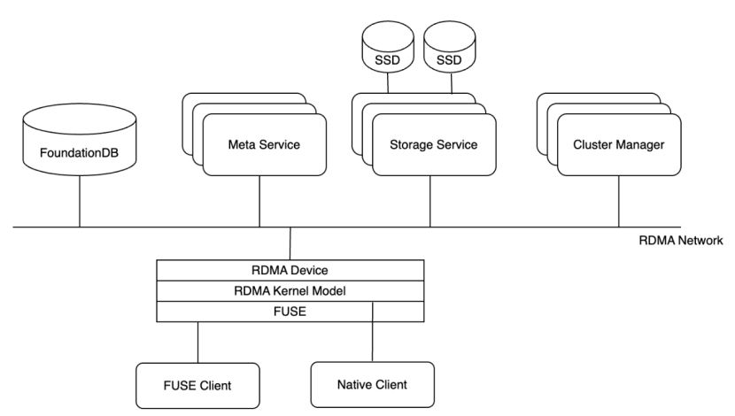

创新点主要包括：
- 软硬件协同设计：硬件层面，Fat-Tree拓扑网络、高速交换机（Infiniband），多个SSD硬盘和高速网卡，保证了高IOPS和吞吐量。软件层面，Direct I/O、AIO异步接口、RDMA Read、数据对齐等技术，减少了内存拷贝和CPU开销，提高了数据读取效率。
- 计算存储分离：3FS将数据存储服务与计算节点分离，专门存储模型训练所需的样本数据。客户端部署在计算节点侧，通过网络访问部署在存储节点侧的3FS服务端。
- 高效的数据读取模式：3FS采用Direct I/O模式读取数据，绕过File Cache，减少了内存消耗。同时，使用Linux AIO和io_uring接口完成样本的异步读取，从而在低CPU占用下实现高读写吞吐。
- 优化的数据格式：3FS推荐使用FFRecord格式存储样本数据。FFRecord支持随机批量读取，包含数据校验功能，并适配PyTorch的Dataset和Dataloader接口。
- 网络优化：3FS通过Infiniband技术构建高速网络，并采用虚拟通道机制隔离不同类型的流量，优化网络配置，优化路由算法。此外，3FS还采用了自研的HFReduce通信库，进一步提升了网络通信效率。
- 用户态文件系统（FUSE）支持：3FS vNext提供了特殊的用户态文件系统FUSE，在用户空间提供3FS vNext的POSIX接口，提高安全性、可维护性，并支持更多的文件操作命令。

**引用**
* Filesystems in the Linux kernel: https://www.kernel.org/doc/html/latest/filesystems/
* Ext4 Layout: https://www.kernel.org/doc/html/latest/filesystems/ext4/overview.html#layout
* Ext4 Group Super Block: https://www.kernel.org/doc/html/latest/filesystems/ext4/globals.html#super-block
* Ext4 Group Descriptors: https://www.kernel.org/doc/html/latest/filesystems/ext4/globals.html#block-group-descriptors
* Ext4 Indexes Nodes: https://www.kernel.org/doc/html/latest/filesystems/ext4/dynamic.html#index-nodes
* Ext4 Direct/Indirect Block Addressing: https://www.kernel.org/doc/html/latest/filesystems/ext4/dynamic.html#direct-indirect-block-addressing
* Performance and Resource Utilization of FUSE User-Space File Systems: https://dl.acm.org/doi/fullHtml/10.1145/3310148
* FUSE: https://www.kernel.org/doc/html/latest/filesystems/fuse.html
* APFS: https://support.apple.com/zh-cn/guide/disk-utility/aside/glose9c04d04/22..6/mac/14.0
* The Sun Network Filesystem: Design, Implementation and Experience: https://cs.ucf.edu/~eurip/papers/sandbergnfs.pdf
* GFS: https://pdos.csail.mit.edu/6.824/papers/gfs.pdf
* CubeFS: https://cubefs.io/zh/docs/master/overview/architecture.html
* 3FS: https://cloud.tencent.com/developer/article/2504081
