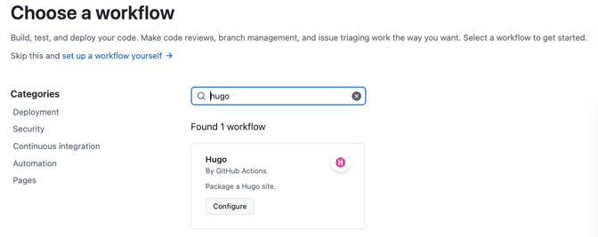

## What is Github Pages?
- GitHub Pages is a free static site hosting service provided by GitHub. 
  It allows you to turn a GitHub repository into a website, making it easy to publish and share web content directly from your code.
- You can use `GitHub Pages` to showcase some open source projects, host a blog, or even share your resume.
- Hugo is one of the most popular open-source static site generators. 
  With its amazing speed and flexibility, Hugo makes building websites fun again.

## How to Build Personal Github Pages Blobs with Hugo?

### Preparation
Before you begin this tutorial you must:
1. [Install Hubo](https://gohugo.io/installation/) (extended or extended/deploy edition, v0.128.0 or later)

> [Download](https://github.com/gohugoio/hugo/releases) the latest version of the binary package according to your operating system.   
> Then extract it and add the path of the binary file to the environment variables.

Verify that you have installed Hugo v0.128.0 or later.
```
hugo version
```

2. [Install Git](https://git-scm.com/book/en/v2/Getting-Started-Installing-Git)

### Step1: Create a site
Run these commands to create a Hugo site with the LoveIt theme. 
The next section provides an explanation of each command.
```
hugo new site quickstart
cd quickstart
git init
git submodule add https://github.com/dillonzq/LoveIt.git themes/LoveIt
echo "theme = 'LoveIt'" >> hugo.toml
hugo server
```
- `hugo new site quickstart` Create the directory structure for your project in the quickstart directory.
```
quickstart/
├── archetypes/
│   └── default.md
├── assets/
├── content/
├── data/
├── i18n/
├── layouts/
├── static/
├── themes/
└── hugo.toml         <-- site configuration
```
- `git init` Initialize an empty Git repository in the current directory.
- `git submodule add` clone and add `LoveIt` theme to your project as a Git submodule.
- `echo "theme = 'ananke'" >> hugo.toml` Append a line to the site configuration file, indicating the current theme.
- `hugo server` Start Hugo’s development server to view the site.
> Web Server is available at http://localhost:1313/.
- Press `Ctrl + C` to stop Hugo’s development server.

### Step2: Add content
Add a new page to your site.
```
hugo new content content/posts/my-first-post.md
```
Add some Markdown to the body of the post, but do not change the draft value.
```
+++
title = 'My First Post'
date = 2024-01-14T07:07:07+01:00
draft = true
+++
## Introduction

This is **bold** text, and this is *emphasized* text.

Visit the [Hugo](https://gohugo.io) website!
```
Notice the draft value in the front matter is true. By default, Hugo does not publish draft content when you build the site.   
Save the file, then start Hugo’s development server to view the site. You can run either of the following commands to include draft content.
```
hugo server --buildDrafts
hugo server -D
```

### Step3: Configure the site
With your editor, open the site configuration file (hugo.toml) in the root of your project.   
Make the following changes:
- Set the `baseURL` for your production site. This value must begin with the protocol and end with a slash, as shown above.
- Set the `languageCode` to your language and region.
- Set the `title` for your production site.

The following is a basic configuration for the LoveIt theme:
```Toml
baseURL = "http://example.org/"

# Change the default theme to be use when building the site with Hugo
theme = "LoveIt"

# website title
title = "My New Hugo Site"

# language code ["en", "zh-CN", "fr", "pl", ...]
languageCode = "en"
# language name ["English", "简体中文", "Français", "Polski", ...]
languageName = "English"

# Menu config
[menu]
  [[menu.main]]
    weight = 1
    identifier = "posts"
    # you can add extra information before the name (HTML format is supported), such as icons
    pre = ""
    # you can add extra information after the name (HTML format is supported), such as icons
    post = ""
    name = "Posts"
    url = "/posts/"
    # title will be shown when you hover on this menu link
    title = ""
  [[menu.main]]
    weight = 2
    identifier = "tags"
    pre = ""
    post = ""
    name = "Tags"
    url = "/tags/"
    title = ""
  [[menu.main]]
    weight = 3
    identifier = "categories"
    pre = ""
    post = ""
    name = "Categories"
    url = "/categories/"
    title = ""

# Markup related configuration in Hugo
[markup]
  # Syntax Highlighting (https://gohugo.io/content-management/syntax-highlighting)
  [markup.highlight]
    # false is a necessary configuration (https://github.com/dillonzq/LoveIt/issues/158)
    noClasses = false
```

### Step4: Publish the site
In this step you will publish your site, but you will not deploy it.

When you publish your site, Hugo creates the entire static site in the public directory in the root of your project. This includes the HTML files, and assets such as images, CSS files, and JavaScript files.

When you publish your site, you typically do not want to include draft, future, or expired content. The command is simple.
```shell
hugo
```

### Step5: Deploy the site as Github Pages

1. Push your local repository to GitHub.

2. Add workflow action for first-time deploy in Github, so that deploying automatically on every commit.
- Click `Action` -> `New workflow`
- Search "Hugo" in the `Search workflows` input frame. It will show you `Hugo` workflow.

- Click `Configure`, the action content looks like the below.
```yaml
# Sample workflow for building and deploying a Hugo site to GitHub Pages
name: Deploy Hugo site to Pages

on:
  # Runs on pushes targeting the default branch
  push:
    branches: ["master"]

  # Allows you to run this workflow manually from the Actions tab
  workflow_dispatch:

# Sets permissions of the GITHUB_TOKEN to allow deployment to GitHub Pages
permissions:
  contents: read
  pages: write
  id-token: write

# Allow only one concurrent deployment, skipping runs queued between the run in-progress and latest queued.
# However, do NOT cancel in-progress runs as we want to allow these production deployments to complete.
concurrency:
  group: "pages"
  cancel-in-progress: false

# Default to bash
defaults:
  run:
    shell: bash

jobs:
  # Build job
  build:
    runs-on: ubuntu-latest
    env:
      HUGO_VERSION: 0.128.0
    steps:
      - name: Install Hugo CLI
        run: |
          wget -O ${{ runner.temp }}/hugo.deb https://github.com/gohugoio/hugo/releases/download/v${HUGO_VERSION}/hugo_extended_${HUGO_VERSION}_linux-amd64.deb \
          && sudo dpkg -i ${{ runner.temp }}/hugo.deb
      - name: Install Dart Sass
        run: sudo snap install dart-sass
      - name: Checkout
        uses: actions/checkout@v4
        with:
          submodules: recursive
      - name: Setup Pages
        id: pages
        uses: actions/configure-pages@v5
      - name: Install Node.js dependencies
        run: "[[ -f package-lock.json || -f npm-shrinkwrap.json ]] && npm ci || true"
      - name: Build with Hugo
        env:
          HUGO_CACHEDIR: ${{ runner.temp }}/hugo_cache
          HUGO_ENVIRONMENT: production
        run: |
          hugo \
            --minify \
            --baseURL "${{ steps.pages.outputs.base_url }}/"
      - name: Upload artifact
        uses: actions/upload-pages-artifact@v3
        with:
          path: ./public

  # Deployment job
  deploy:
    environment:
      name: github-pages
      url: ${{ steps.deployment.outputs.page_url }}
    runs-on: ubuntu-latest
    needs: build
    steps:
      - name: Deploy to GitHub Pages
        id: deployment
        uses: actions/deploy-pages@v4
```
- naming it with any name you want and then click `Commit changes` to add it to your repo.
- When GitHub has finished building and deploying your site, the color of the status indicator will change to green.

## Others
- [Image Processing]( https://gohugo.io/content-management/image-processing/#page-resource)

##### Reference:
- https://gohugo.io/getting-started/quick-start/
- https://hugoloveit.com/theme-documentation-basics/
- https://gohugo.io/content-management/image-processing/#page-resource
